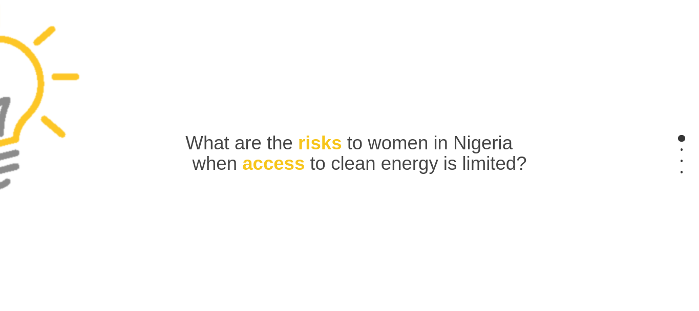

## Nigerian Women's Health and Access to Electricity

This project presents data for Nigeria from World Bank and Global Burden of Disease Collaborative Network, broken down by gender, access to infrastructure, and types of disease.  The visualizations will highlight underserved populations and attempt to clarify additional health risks unique to women when access to electricity is poor.  
